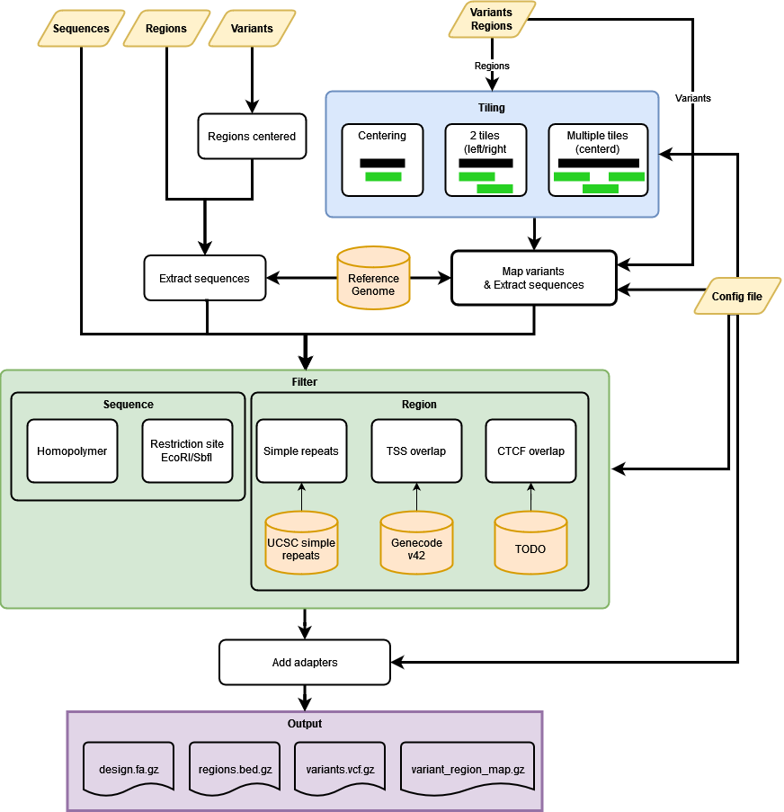

.. _Homepage:

====================================
MPRAOligoDesign's documentation
====================================

.. image:: https://img.shields.io/badge/GitHub-repository-brightgreen?logo=github
    :alt: GitHub Repository
    :target: https://github.com/kircherlab/MPRAOligoDesign

.. image:: https://readthedocs.org/projects/mpraoligodesign/badge/?version=latest
    :target: https://mpraoligodesign.readthedocs.io/en/latest/?badge=latest
    :alt: Documentation Status

.. image:: https://zenodo.org/badge/565841201.svg
    :target: https://doi.org/10.5281/zenodo.18173304
    :alt: DOI

.. image:: https://img.shields.io/github/license/kircherlab/MPRAOligoDesign
    :target: https://github.com/kircherlab/MPRAOligoDesign/blob/master/LICENSE
    :alt: GitHub License

.. image:: https://img.shields.io/github/v/release/kircherlab/MPRAOligoDesign
    :target: https://github.com/kircherlab/MPRAOligoDesign/releases/latest
    :alt: GitHub Release

.. image:: https://img.shields.io/badge/snakemake-≥7.20.0-brightgreen.svg
    :target: https://snakemake.bitbucket.io
    :alt: Snakemake

.. image:: https://github.com/kircherlab/MPRAOligoDesign/workflows/Tests/badge.svg
    :target: https://github.com/kircherlab/MPRAOligoDesign/actions/workflows/main.yml
    :alt: Tests

.. image:: https://img.shields.io/github/issues/kircherlab/MPRAOligoDesign
    :target: https://github.com/kircherlab/MPRAOligoDesign/issues
    :alt: GitHub Issues

.. image:: https://img.shields.io/github/issues-pr/kircherlab/MPRAOligoDesign
    :target: https://github.com/kircherlab/MPRAOligoDesign/pulls
    :alt: GitHub Pull Requests

**Welcome!**

Workflow to design oligos for MPRA out of regions (and variants).

MPRAOligoDesign is built on top of `Snakemake <https://snakemake.readthedocs.io/>`_. Insert your code into the respective folders, i.e. ``scripts``, ``rules``, and ``envs``. Define the entry point of the workflow in the ``Snakefile`` and the main configuration in a ``config.yaml`` file.

Authors
    Max Schubach (`@visze <https://github.com/visze>`_)
    `Computational Genome Biology Group <https://kircherlab.bihealth.org>`_
    Berlin Institute of Health at Charité
    Universitätsklinikum Berlin 
    

Usage
    If you use this workflow in a paper, don't forget to give credits to the authors by citing the URL of the (original) repository and, if available, it's DOI. (see above)

Installation & Getting Started
    Instructions for the Installation of the program and some examples to get you started.

Project Information
    More information on the project, including the changelog, list of contributing authors, and contribution instructions.

=====================
Overview
=====================

Workflow to gerenate an oligo design for an MPRA experiments. It has mltiple ways to generate sequences:

1. Variants (vcf) + regions (bed)
2. Variants (vcf)
3. Regions (bed)
4. Sequnces (fasta)

All 4 strategies can be combined latzer into one final design files. This allows you to put controlls as well as your deisgn in one workflow.

When sequences are generated it filters them with multiple check:
1. Homopolymer size (for all)
2. EcoRI or SbfI restriction site  (for all)
3. Simple repeats (not pure sequences)
4. TSS site overlap (not pure sequences)
5. CTCF overlap (not pure sequences)

-------------
Quick Example
-------------

To run MPRAOligoDesign, first activate the snakemake environment with the following command:

.. code-block:: bash

    conda activate snakemake

And then run the main workflow with:

.. code-block:: bash

    snakemake --use-conda --cores $N --configfile config/config.yaml

--------
Features
--------

:--use-conda:
  This utility uses conda to efficiently query repositories and query package dependencies.
:--cores:
  This utility sets the number of cores ($N) to be used by MPRAOligoDesign.
:--configfile:
  This file (e.g., ``config/config.yaml``) contains the project, its objects and properties, and sub-properties and its objects that **must** be set before running MPRAOligoDesign.

--------
Feedback
--------

Feel free to leave feedback(s), ask question(s), or report bug(s) at our issues page: `MPRAOligoDesign Issues <https://github.com/kircherlab/MPRAOligoDesign/issues>`_.

Indices and tables
==================

* :ref:`genindex`
* :ref:`search`

.. toctree::
    :caption: Installation & Getting Started
    :name: getting-started
    :maxdepth: 1
    :hidden:

    overview
    quickstart
    install
    config

.. toctree::
    :caption: Tips & Tricks
    :name: tips-tricks
    :maxdepth: 1
    :hidden:

    faq

.. toctree::
   :caption: Project Info
   :name: project-info
   :maxdepth: 1
   :hidden:

   contributing
   authors
   history
   license
   todo_list
