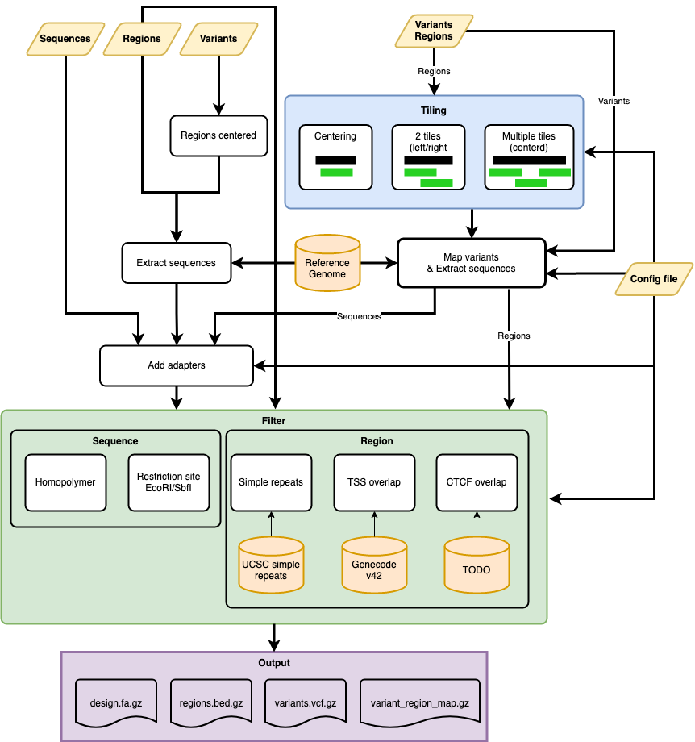

.. _Overview:

=====================
Overview
=====================

Workflow to gerenate an oligo design for an MPRA experiments. It has mltiple ways to generate sequences:

1. Variants (vcf) + regions (bed)
2. Variants (vcf)
3. Regions (bed)
4. Sequnces (fasta)

All 4 strategies can be combined latzer into one final design files. This allows you to put controlls as well as your deisgn in one workflow.

When sequences are generated it filters them with multiple check:
1. Homopolymer size (for all)
2. EcoRI or SbfI restriction site  (for all)
3. Simple repeats (not pure sequences)
4. TSS site overlap (not pure sequences)
5. CTCF overlap (not pure sequences)

